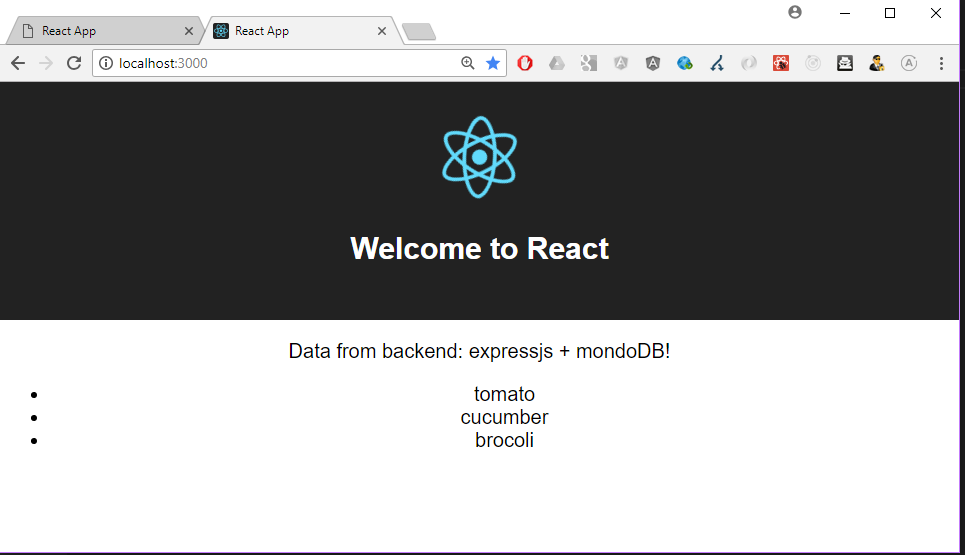
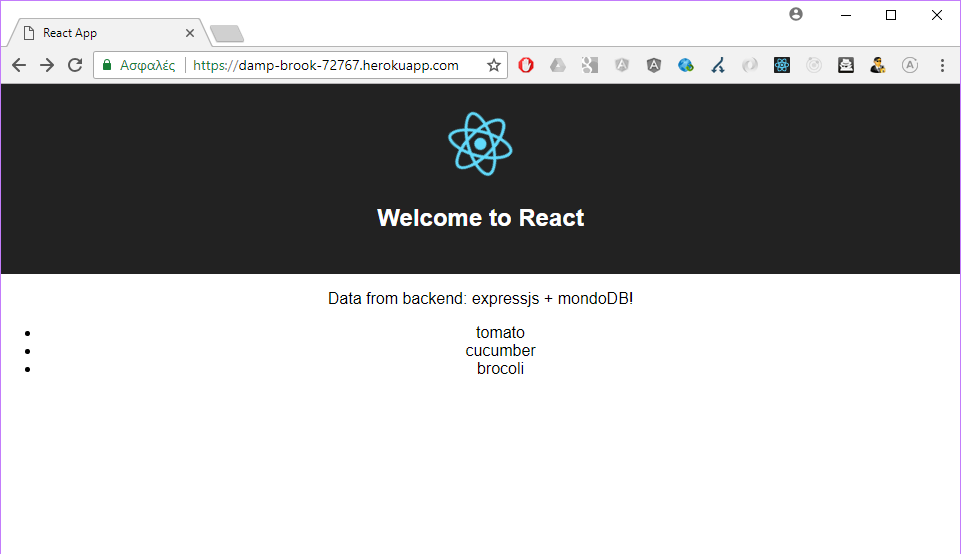
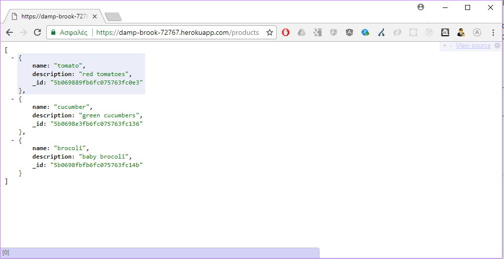

# fullstack-shop

In a few words :

It is a full stack application, mongodb + expressjs + reactjs + nodejs, ready to be deployed on Heroku.com

This application is oriented to be deployed on Heroku, so ,as it is, it does not work locally.

In order to work locally needs some changes, and run dev serve r& express server seperatelly(you can as well do it no just one script): 

  1. Add proxy property on client\package.json. (n.7 further down)
      "proxy": "http://localhost:3001" , so the requests from the client are directed to express server on port 3001.
      We dont need 'server' on line 5 & 12, since we' ll use 'proxy'.
  2. Run dev server from inside '/client'.
      $npm run start
  3. Run express server local.
      On the root of the application, not into client folder:
      $ npm run start  <!-- starts express server -->
  4. Now open the browser on localhost:3000,
      e.g. http://localhost:3000 and you should get the product data from local db or remote db.

  

- Tools that need to sync and work together
  - Heroku
  - mlab
  - reactjs
  - expressjs

- Below are the steps for creating that app from scratch until you see it live on Heroku.

  1. create express skeleton with 'express-generator'
	$ express shop // creates a simple expressjs app
	Inside the express i create some routes. 
	
  2. create the reactjs app with 'create-react-app'
    $ create-react-app client  // i run this command into the /shop folder
    $ npm run eject    // eject the hidden folders 'scripts' & 'config'

  3. create the Heroku application either Heroku CLI or from Heroku.com
  
  4. Create a free account on mlab.com.
  As soon we create a new db, we get the connection string,
  e.g. mongodb://<dbuser>:<dbpassword>@ds133630.mlab.com:33630/db
  
  5. Dont run locally, $ npm run start, because there will be 
  a CORS issue with the server 'https://damp-brook-72767.herokuapp.com'.
  I havent solve that yet. (for localhost ee above)
  
  6. Since everything is in place. 
     1. Check first NOT to be any errors, when execute '$ npm run build'
	 locally.
	 2. commit any changes to 'master' branch
	 3. push to Heroku master
	 4. cross our fingers and open the webpage on Heroku.
 

  
  
  

  7. package.json property for testing localhost:
      - "proxy": "http://localhost:3001", <!-- expressjs PORT -->
  8. package.json property for hosting app on github
      - "homepage": "https://tornado1979.github.io/fullstack-shop/", <!-- in case we host the app on Github-->
	